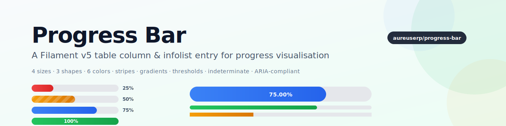

# Progress Bar for Filament v5

[](https://packagist.org/packages/webkul/progress-bar)
[](LICENSE.md)

<p align="center">
    <picture>
        <source media="(prefers-color-scheme: dark)" srcset="art/banner-dark.svg">
        
    </picture>
</p>

A feature-rich **Filament v5** table column & infolist entry that renders progress as a horizontal bar. Built for dashboards, task progress, capacity gauges, skill levels, and any numeric value that fits on a 0–100% (or custom min–max) scale.

---

## Table of contents

- [Features](#features)
- [Requirements](#requirements)
- [Installation](#installation)
- [Theme setup](#theme-setup)
- [Quick start](#quick-start)
- [API reference](#api-reference)
  - [Value](#value)
  - [Display](#display)
  - [Color](#color)
  - [Icon](#icon)
  - [Accessibility](#accessibility)
- [Enums](#enums)
- [Real-world example](#real-world-example)
- [Theming & customisation](#theming--customisation)
- [Translations](#translations)
- [Publishing resources](#publishing-resources)
- [Testing](#testing)
- [Troubleshooting](#troubleshooting)
- [Security](#security)
- [Contributing](#contributing)
- [Credits](#credits)
- [License](#license)

---

## Features

- **Table column** — drop into any Filament table as a percentage/gauge column
- **Infolist entry** — read-only progress visualisation for detail pages
- **4 sizes** — Tiny, Small, Medium, Large
- **3 shapes** — Rounded, Pill, Square
- **6 colors** — primary / success / warning / danger / info / gray, plus custom panel colors
- **Threshold-driven colors** — `->thresholds([90 => 'success', 50 => 'warning', 0 => 'danger'])`
- **Warn above** — `->warnAbove(100)` auto-flags over-budget values
- **Stripes + animation** — striped or scrolling diagonal pattern overlay
- **Indeterminate** — looping animation when the progress is unknown
- **Gradient fill** — smooth left→right colour transition
- **Label anywhere** — inside, outside, or hidden; custom formatter with full control
- **Icons** — start/end icon adjacent to the label
- **ARIA-compliant** — always emits `role="progressbar"`, `aria-valuenow/min/max`, `aria-label`
- **Type-safe enums** — `Size::Large`, `Shape::Pill`, `LabelPosition::Outside`, `IconPosition::End`; strings still work
- **Self-contained CSS** — Tailwind-compiled, no dependency on Filament's button/badge classes
- **Translations** — `en` and `ar` shipped

---

## Requirements

- PHP 8.2+
- Laravel 11+
- Filament v5+
- Tailwind CSS (via a custom Filament theme if you use Panels)

---

## Installation

```bash
composer require webkul/progress-bar
```

Service provider is auto-discovered. CSS is registered via `FilamentAsset` and published automatically during `artisan filament:assets`.

---

## Theme setup

> [!IMPORTANT]
> If you are using Filament Panels and have not set up a custom theme, follow [Creating a custom theme](https://filamentphp.com/docs/5.x/styling/overview#creating-a-custom-theme) first.

Add the plugin's Blade files to your theme's CSS so Tailwind picks up its utility classes:

```css
/* resources/css/filament/admin/theme.css */
@source '../../../../vendor/webkul/progress-bar/resources/**/*.blade.php';
```

Rebuild your theme: `npm run build`.

---

## Quick start

### Table column

```php
use Webkul\ProgressBar\Tables\Columns\ProgressBar;

ProgressBar::make('progress')
    ->label('Completion')
    ->color(fn ($record) => $record->progress >= 100 ? 'success' : 'primary');
```

### Infolist entry

```php
use Webkul\ProgressBar\Infolists\Components\ProgressBar;

ProgressBar::make('level')
    ->label('Skill level')
    ->getStateUsing(fn ($record) => $record->level);
```

Both components extend Filament base classes (`Column` and `Entry`), so every standard method (`->label()`, `->sortable()`, `->toggleable()`, `->visible()`) still works.

---

## API reference

### Value

```php
->max(int | float | Closure $max = 100)           // upper bound (default 100)
->min(int | float | Closure $min = 0)             // lower bound (default 0)
->value(int | float | Closure $value)             // explicit state override
->precision(int $decimals = 2)                    // decimals for non-100% display
->formatLabel(Closure $fn)                        // full control: (value, percentage, min, max) → string
```

### Display

```php
use Webkul\ProgressBar\Enums\{Size, Shape, LabelPosition};

->size(Size::Large)                               // or 'lg'   — Tiny | Small | Medium | Large
->shape(Shape::Pill)                              // or 'pill' — Rounded | Pill | Square
->labelPosition(LabelPosition::Outside)            // or 'outside' — Inside | Outside | None
->showLabel(bool | Closure $condition = true)      // shortcut: false → LabelPosition::None
->striped(bool | Closure = true)                   // diagonal stripes
->animated(bool | Closure = true)                  // scrolling stripes (implies striped)
->indeterminate(bool | Closure = true)             // sliding animation (value ignored)
->gradient(bool | Closure = true)                  // left→right colour gradient
```

### Color

```php
->color(string | Closure $color)                   // primary / success / warning / danger / info / gray / custom
->trackColor(string | Closure $color = 'gray')     // unfilled-track color
->thresholds(array | Closure $map)                 // [90=>'success', 75=>'info', 50=>'warning', 0=>'danger']
->warnAbove(int | float $threshold,
            string $color = 'danger')              // over-threshold paints with $color
```

Resolution order: `warnAbove` → `thresholds` → `color()` → fallback `primary`.

### Icon

```php
use Webkul\ProgressBar\Enums\IconPosition;

->icon(string | Closure $heroicon)                 // 'heroicon-m-check-circle' etc.
->iconPosition(IconPosition::End)                   // or 'end' — Start | End
```

### Accessibility

Every render emits:

```html
<div class="pb-track" role="progressbar"
     aria-valuenow="{percentage}"
     aria-valuemin="{min}"
     aria-valuemax="{max}"
     aria-label="{formatted label}">
    <div class="pb-fill" style="width: {percentage}%"></div>
</div>
```

For indeterminate bars, `aria-valuenow` is omitted (per the WAI-ARIA spec).

---

## Enums

| Enum | Cases → values | Default |
|---|---|---|
| `Size` | `Tiny` → `'xs'`, `Small` → `'sm'`, `Medium` → `'md'`, `Large` → `'lg'` | `Size::Medium` |
| `Shape` | `Rounded`, `Pill`, `Square` | `Shape::Rounded` |
| `LabelPosition` | `Inside`, `Outside`, `None` | `LabelPosition::Inside` |
| `IconPosition` | `Start`, `End` | `IconPosition::Start` |

Each exposes a `default()` static. Setters accept `Enum | string | Closure`; getters return the string value so Blade `data-pb-*` attributes and the CSS keep working unchanged.

```php
use Webkul\ProgressBar\Enums\{Size, Shape, LabelPosition, IconPosition};

ProgressBar::make('progress')
    ->size(Size::Large)
    ->shape(Shape::Pill)
    ->labelPosition(LabelPosition::Outside)
    ->icon('heroicon-m-check-circle')
    ->iconPosition(IconPosition::End);
```

---

## Real-world example

Adapted from a skill-level table (the pattern that originally motivated the extraction):

```php
use Webkul\ProgressBar\Enums\Shape;
use Webkul\ProgressBar\Enums\Size;
use Webkul\ProgressBar\Tables\Columns\ProgressBar;

ProgressBar::make('level')
    ->label('Proficiency')
    ->getStateUsing(fn ($record) => $record->level)
    ->size(Size::Small)
    ->shape(Shape::Pill)
    ->striped()
    ->thresholds([
        80 => 'success',
        50 => 'warning',
        20 => 'info',
        0  => 'danger',
    ])
    ->formatLabel(fn (float $percentage, float $value) => sprintf('%d / 100', $value))
    ->sortable()
    ->toggleable();
```

Task progress in a project dashboard:

```php
ProgressBar::make('progress')
    ->label('Completion')
    ->warnAbove(100, 'danger')              // over-budget → red
    ->color(fn ($record) => $record->progress >= 100 ? 'success' : 'primary')
    ->animated()
    ->size(Size::Medium);
```

---

## Theming & customisation

The plugin ships a Tailwind-compiled CSS bundle keyed on stable data attributes you can target in your own theme:

- `.pb-wrapper` — outer wrapper (flex column, used for outside-label layout)
- `.pb-track` — the track
- `.pb-fill` — the filled portion
- `.pb-label` / `.pb-label-outside` — label text
- `.pb-icon` — icon inside the label

Data attributes on `.pb-track`:

- `data-pb-size="xs|sm|md|lg"` — height
- `data-pb-shape="rounded|pill|square"` — corner radius
- `data-pb-color="primary|success|warning|danger|info|gray|…"` — drives `--pb-color-500/600` CSS variables
- `data-pb-indeterminate="true|false"` — triggers the slide animation

Data attributes on `.pb-fill`:

- `data-pb-striped="true"` — adds diagonal stripes
- `data-pb-animated="true"` — animates the stripes
- `data-pb-gradient="true"` — left→right colour gradient
- `data-pb-full="true"` — set when progress is 100% (used to switch label colour to white)

### Custom colors

Register a panel color and reference it in the progress bar:

```php
// AdminPanelProvider
->colors(['magenta' => '#b72d81'])

// Usage
->color('magenta')
```

---

## Translations

Ships with `en` and `ar` under the `progress-bar::` namespace for aria labels and enum display names. Publish to override:

```bash
php artisan vendor:publish --tag="progress-bar-translations"
```

---

## Publishing resources

```bash
php artisan vendor:publish --tag="progress-bar-config"
php artisan vendor:publish --tag="progress-bar-views"
php artisan vendor:publish --tag="progress-bar-translations"
```

---

## Testing

```bash
vendor/bin/pest plugins/webkul/progress-bar/tests/Feature
```

The plugin ships a full Pest suite covering:

| Area | Coverage |
|---|---|
| Architecture | Column extends `Filament\Tables\Columns\Column`, Entry extends `Filament\Infolists\Components\Entry`, shared trait used on both, Plugin implements `Filament\Contracts\Plugin`, no debug calls in shipped code |
| Value API | `max`, `min`, `value`, `precision`, `formatLabel`, `getPercentage` edge cases (>100, <0, non-numeric, reversed min/max) |
| Layout API | `size`, `shape`, `labelPosition`, `showLabel` — enum + string input, default fallback |
| Behaviour | `striped`, `animated` (auto-enables striped), `indeterminate`, `gradient` |
| Status / threshold | `thresholds()` + `warnAbove()` correctly map value → color |
| Enum input | `Size::Large`, `Shape::Pill`, `LabelPosition::Outside`, `IconPosition::End` round-trip |
| Content | `formatLabel` closure, `icon` + `iconPosition`, `precision` formatting |
| Component instantiation | Base class, view paths, fluent chaining, Column-only `color()` / Infolist `color()` |

Fixtures live at `tests/Feature/Fixtures/`.

---

## Troubleshooting

| Symptom | Likely cause | Fix |
|---|---|---|
| `Target class not found` | Autoload cache stale | `composer dump-autoload && php artisan optimize:clear` |
| View not found | Service provider not registered | `php artisan package:discover` |
| Styles look wrong | Theme didn't scan plugin Blade files | Add the `@source` directive in [Theme setup](#theme-setup) |
| Bar stays empty | `max()` is smaller than current value, or `min()` equals `max()` | Verify `min < max` and the resolved state is numeric |

---

## Security

Email `support@webkul.com` for security-related reports instead of opening a public issue.

---

## Contributing

PRs welcome. Before submitting:

```bash
vendor/bin/pest plugins/webkul/progress-bar/tests/Feature
vendor/bin/pint plugins/webkul/progress-bar
```

When adding a new option:

1. Define a `BackedEnum` under `src/Enums/` if the option is one of a fixed set.
2. Accept both the enum and the raw string in the setter signature.
3. Add coverage under `tests/Feature/Unit/`.
4. Document the option in the [API reference](#api-reference) and [Enums](#enums) sections.

---

## Credits

- [Webkul](https://webkul.com) — plugin author
- [Filament team](https://filamentphp.com) — the excellent admin framework
- [filamentphp/plugin-skeleton](https://github.com/filamentphp/plugin-skeleton) — structural template

---

## License

MIT. See [LICENSE.md](LICENSE.md).
